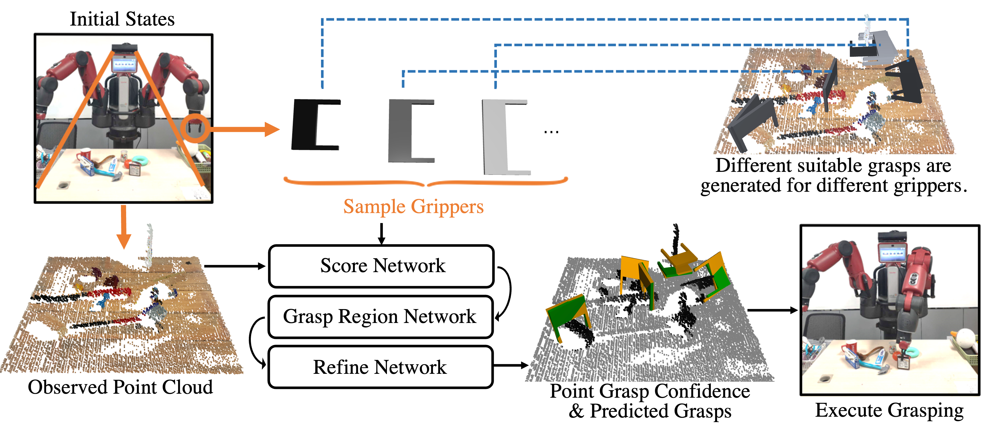
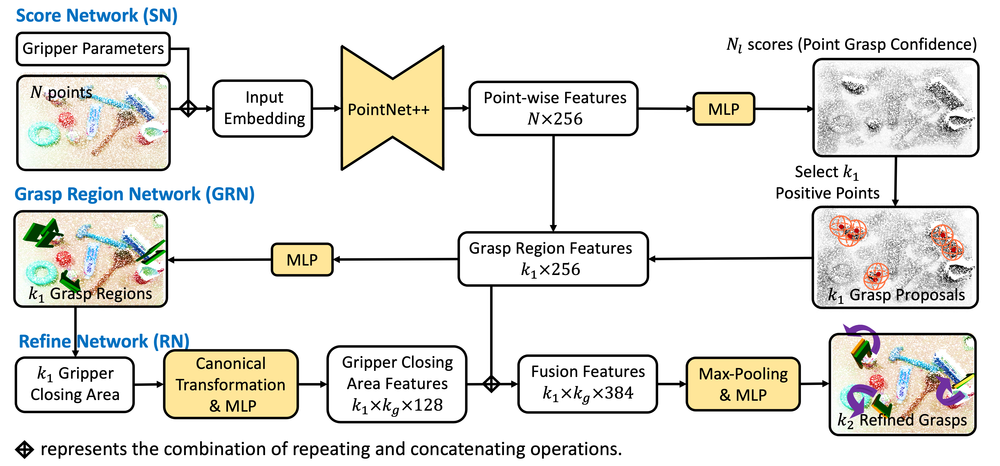

# REGNet-V2: End-to-End REgion-based Grasp Detection with Point Clouds

REGNetV2 is a robotic grasp detection algorithm that can adapt to different parallel jaws to grasp diversified objects.
It includes three components: Score Network (SN), Grasp Region Network (GRN), and Refine Network (RN).
In the first stage, SN is used to filter suitable points for grasping by point grasp confidence scores.
In the second stage, based on the selected points, GRN generates a set of grasp proposals.
Finally, RN refines the grasp proposals for more accurate and robust predictions.


## INSTALL (Env: python=3.6)
```
# sudo apt install libgl1-mesa-glx ffmpeg libsm6 libxext6
pip3 install -r requirements.txt
cd multi_model/utils/pn2_utils
python3 setup.py install
(python3 setup.py install --user)
cd functions
python3 setup.py install
(python3 setup.py install --user)
```

## RUN

### 1.Data Preparation
- dataset
Download REGNetV2_dataset from [this URL](https://stuxjtueducn-my.sharepoint.com/:u:/g/personal/pertelisten_stu_xjtu_edu_cn/ERvM9XASKDZGv63H3hqRVxsBTNJ0n2WVO1KBpoqU2uYy_Q?e=eXh3EZ)
```
tar -C dataset -zxvf REGNetV2_dataset.tar.gz
```
- test file
Download the test files from [this URL](https://stuxjtueducn-my.sharepoint.com/:u:/g/personal/pertelisten_stu_xjtu_edu_cn/EQWj9_33BoRInWk5lDno4AsBx-JC6I1k2VBoUyFkdWhCQQ?e=VJmcHt)
```
tar -C test_file -zxvf test_file.tar.gz
```

### 2.Train 

Change '--data-path', '--model-path', 'log-path' to your folder path.
- train for **REGNet**
```
python3 train.py --gpu 0 --gpu-num 3 --gpus 0,1,2 --batch-size 24 --mode pretrain --method class_01 --layer 0 --conf_times 0.0025 --use_region  --epoch 21 --tag pre_regnet

python3 train.py --batch-size 24 --gpu 0 --gpu-num 3 --gpus 0,1,2 --mode train --method class_01 --layer 0 --conf_times 0.0025 --use_region  --use_rgb --tag regent --load-path assets/models/pre_regnet/region_20.model
```

- train for **REGNetV2 (layer1)**
```
python3 train_multi.py --batch-size 6 --gpu 0 --gpu-num 3 --gpus 0,1,2 --mode pretrain --method class_01 --layer 0 --conf_times 0.03 --epoch 16 --use_region --use_rgb --tag pre_multigrasp_layer1

python3 train_multi.py --batch-size 6 --gpu 0 --gpu-num 3 --gpus 0,1,2 --mode train --method class_01 --layer 0 --conf_times 0.03 --epoch 16 --use_region --use_rgb --tag multigrasp_layer1 --load-path assets/models/pre_multigrasp_layer1/region_10.model
```

- train for **REGNetV2 (layer2)**
```
python3 train_multi.py --batch-size 6 --gpu 0 --gpu-num 3 --gpus 0,1,2 --mode pretrain --method class_01 --use_region --use_rgb --layer 1 --conf_times 0.15 --epoch 16 --tag pre_multigrasp_layer2

python3 train_multi.py --batch-size 6 --gpu 0 --gpu-num 3 --gpus 0,1,2 --mode train --method class_01 --layer 1 --conf_times 0.15 --epoch 16 --use_region --tag multigrasp_layer2 --load-path assets/models/pre_multigrasp_layer2/region_10.model
```
Since the number of grasps in one batch of **REGNet** model is less than **REGNetV2 (layer1&2)**, we increase the batch size in the training process of REGNet.


As shown in the picture of network architecture, pre-training process is used to train the SN and GRN
stage.
You can directly train the model without pre-training process. However, the training time will increase.

-----

### 3.Test 

- test for **REGNet**
```
python3 test_dataset.py --gpu 0 --gpu-num 2 --gpus 0,1 --batch-size 6 --mode test --method class_01 --layer 0 --conf_times 0.0025 --use_region  --eval-diffwidth --tag regnet_test --load-path test_assets/regent/refine_30.model
```

- test for **REGNetV2 (layer1)**
```
python3 test_multi_dataset.py --gpu 0 --gpu-num 1 --batch-size 6 --mode test --method class_01 --use_region --use_rgb --layer 0 --conf_times 0.03 --eval-diffwidth --load-path test_assets/multigrasp_layer1/refine_15.model --tag multigrasp_layer1_test
```

- test for **REGNetV2 (layer2)**
```
python3 test_multi_dataset.py --gpu 0 --gpu-num 1 --batch-size 6 --mode test --method class_01 --use_region --use_rgb --layer 1 --conf_times 0.15 --eval-diffwidth --load-path test_assets/multigrasp_layer2/refine_15.model --tag multigrasp_layer2_test
```

-----

### 4.Predict grasps from files 
```
python grasp_detect_from_file_multiobjects.py --cuda --gpu 0 --load-model test_assets/multigrasp_layer1/refine_15.model --method multigrasp_layer1 --eval-width 0.07 --use_region --use_analytic --camera kinect2
```

We provide some real-world observed point clouds under three different perspectives for test.
```
test_file
|--scene*
   |--camera1.py -> camera: "kinect2"
   |--camera2.py -> camera: "kinectdk_right"
   |--camera3.py -> camera: "kinectdk_left"
```

The trained models contain REGNet, REGNetV2(layer1), REGNetV2(layer2).
```
test_assets
|--regnet
   |--refine_30.model -> method regnet
|--multigrasp_layer1
   |--refine_15.model -> method multigrasp_layer1
|--multigrasp_layer2
   |--refine_15.model -> method multigrasp_layer2
```

Note that the parameters of load-model, method should be in one-to-one correspondence, and camera needs to correspond to the test file's name.
